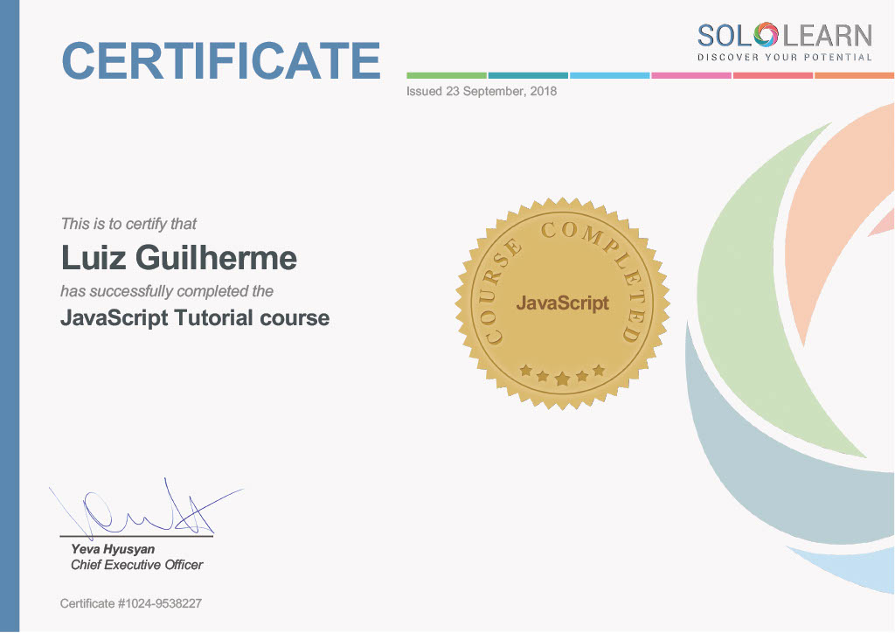

# Certificates

## Course / Institution

* Algoritmos - Curso em video - [Go to](#algoritmos---curso-em-video) - [Certificate](./doc/algoritmo-cursoemvideo.md)
* A2 Technical English - FreeCodeCamp - [Go to](#a2-technical-english-for-developers---freecodecamp) - [Certificate](./img/cert-a2-english-freecodecamp.jpg)
* Algoritmos - Guanabara - [Go to](#algoritmos---guanabara) - [Certificate](./img/certificadoalgoritmoscursoemvideo.jpg)
* HTML & CSS - Savannah Technical College - [Go to](#html--css---savannah-technical-college) - [Certificate](./doc/savannahcollege_htmlcss.md)
* Javascript - Savannah Technical College - [Go to](#javascript---savannah-technical-college) - [Certificate](./doc/savannah_college_web.md)
* HTML & CSS - Code Academy - [Go to](#html--css---code-academy) - [Certificate](./doc/codeacademy.md)
* JavaScript - SoloLearn - [Go to](#javascript---sololearn) - [Certificate](./doc/sololearn_javascript.md)
* ScrumMaster - Linkedin Learning - [Go to](#scrummaster---linkedin-learning) - [Certificate](./img/CertificadoDeConclusao_ScrumMaster.pdf)
* HTML - Linkedin Learning - [Go to](#html---linkedin-learning) - [Certificate](./img/CertificadoDeConclusao_HTML%20Formacao%20Basica.pdf)
* CSS - Linkedin Learning - [Go to](#css---linkedin-learning) - [Certificate](./img/CertificadoDeConclusao_Descubra_o_CSS.pdf)
* Fundamentos da Ciencia de Dados - [Go to](#fundamentos-da-ciência-de-dados---linkedin-learning) - Linkedin Learning [Certificate](./img/CertificadoDeConclusao_FundamentosdaCienciadeDados.pdf)

___

## Algoritmos - Curso em video

[Go Back](#certificates)

## A2 Technical English for Developers - FreeCodeCamp

[Go Back](#certificates)

## Algoritmos - Guanabara

[Go Back](#certificates)

## HTML & CSS - Savannah Technical College

[Go Back](#certificates)

## Javascript - Savannah Technical College

[Go Back](#certificates)

## HTML & CSS - Code Academy

[Go Back](#certificates)

## Javascript - SoloLearn

[Go Back](#certificates)

## ScrumMaster - Linkedin Learning

[Go Back](#certificates)

## HTML - Linkedin Learning

[Go Back](#certificates)

## CSS - Linkedin Learning

[Go Back](#certificates)

## Fundamentos da Ciência de Dados - Linkedin Learning

[Go Back](#certificates)

